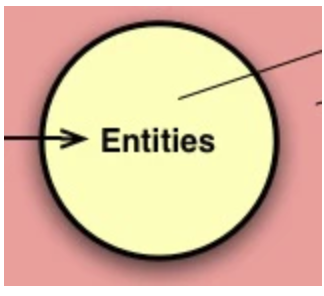
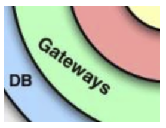
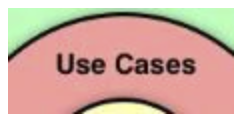
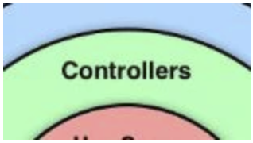
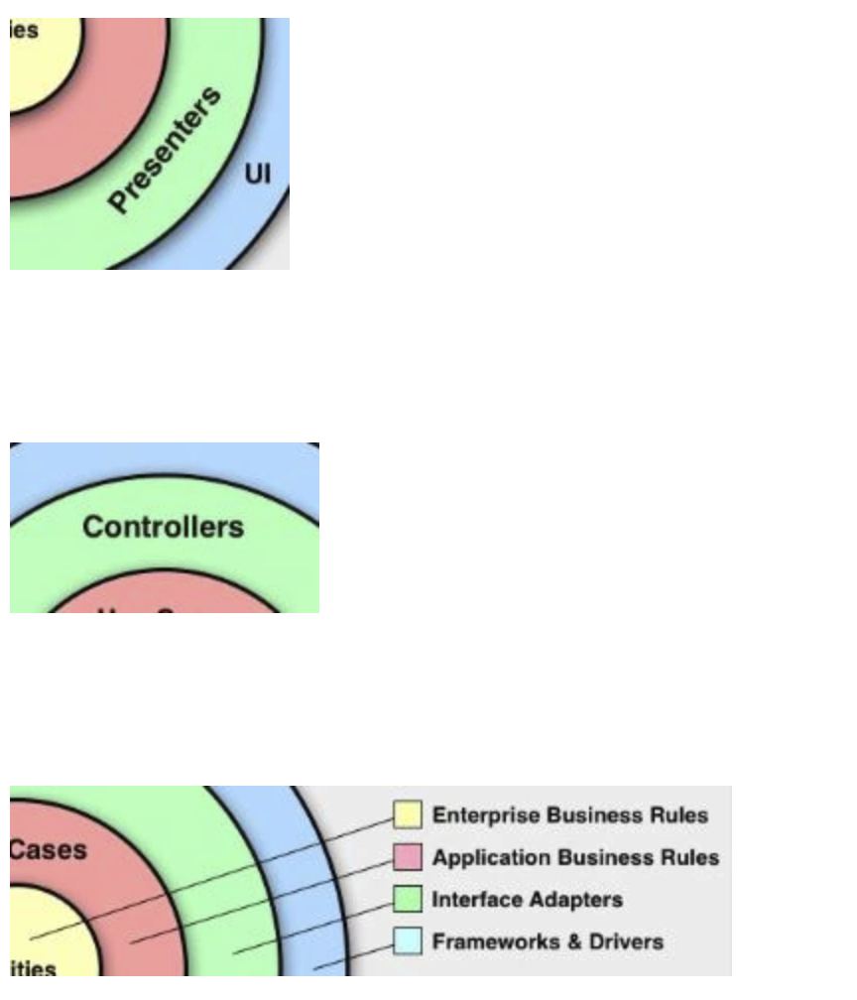
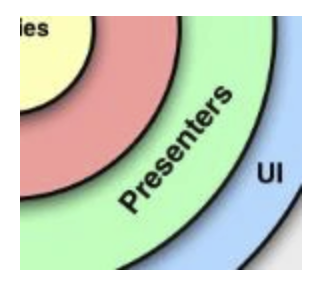
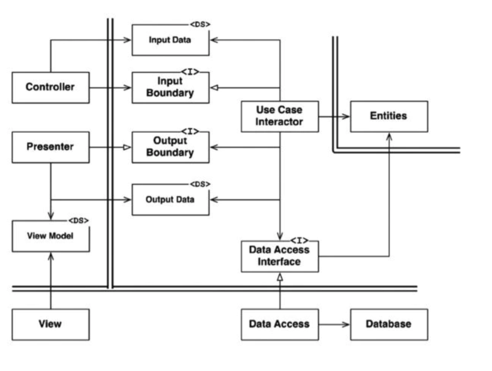

# Clean architecture

## Introduction

[Clean architecture](https://blog.cleancoder.com/uncle-bob/2012/08/13/the-clean-architecture.html)


Speaking of clean architecture, the first thing that comes to mind is this iconic diagram.
If you take a quick look at this figure, it looks like a very abstract figure, so it is undeniable that you feel "what kind of code should you actually use?"
However, to tell the truth, this can be directly incorporated into the implementation.
If so, I wonder if I should make an implementation example, so the following two articles are implemented based on this figure.

## Entities



When you look at the term entity, you may think of Domain Driven Designed entities.
Other than that, you may think of something like a database table created as an object.

Entities in a clean architecture are different from any of them.

An entity is an object that encapsulates a business rule.

It's a so-called domain model, and its definition is much wider than that of Domain Driven Design entities.

By the way, what is prepared as an entity in this application is the one that exists in the following directory.

- packages\Domain\Domain

Specifically, this includes User and UserId.
It's a poorly implemented model, but the entity itself isn't the subject, so let's move on to the next item.

## Gateways



In this application, the one prepared as a repository is applicable.

When you translate a repository, it means a warehouse or something like that.
A repository in the context of software is a warehouse of data, the object responsible for data persistence.

The following modules are such gateways.
- packages\Domain\Domain\User\UserRepositoryInterface
- packages\Infrastructure\User\UserRepository
- packages\InMemoryInfrastructure\User\InMemoryUserRepository

It may seem difficult because there are quite a few modules in different namespaces, but each one is very easy.

### packages\Domain\Domain\User\UserRepositoryInterface

```php
interface UserRepositoryInterface
{
    /**
     * @param User $user
     * @return mixed
     */
    public function save(User $user);

    /**
     * @param UserId $id
     * @return User
     */
    public function find(UserId $id);

    /**
     * @param int $page
     * @param int $size
     * @return mixed
     */
    public function findByPage($page, $size);
}
```

The repository interface is a convention for data persistence procedures.

- What kind of data should be saved when saving the data of a specific data (User in this case)? (Save method.)
- What are some ways to get the stored data? (Find, findByPage method.)

It represents these rules.

Saving and reconstructing data in this way is called data persistence.

When you think of data persistence, you might think of a direct storage medium such as a database or file.
However, data persistence here is not limited to that.
We'll talk more about what this means in the InMemoryUserRepository below.
Let's move on to the next item.

### packages\Infrastructure\User\UserRepository

```php
class UserRepository implements UserRepositoryInterface
{
    /**
     * @param User $user
     * @return mixed
     */
    public function save(User $user)
    {
        DB::table('users')
            ->updateOrInsert(
                ['id' => $user->getId()],
                ['name' => $user->getName()]
            );
    }

    /**
     * @param UserId $id
     * @return User
     */
    public function find(UserId $id)
    {
        $user = DB::table('users')->where('id', $id->getValue())->first();

        return new User($id, $user->name);
    }

    /**
     * @param int $page
     * @param int $size
     * @return mixed
     */
    public function findByPage($page, $size)
    {
        // TODO: Implement findByPage() method.
    }
}
```

As you can see, we are storing the data in a database. (Some are not implemented.)
UserRepository is an object that persists data to the database.

### packages\InMemoryInfrastructure\User\InMemoryUserRepository

```php
class InMemoryUserRepository implements UserRepositoryInterface
{
    private $db = [];

    /**
     * @param User $user
     * @return mixed
     */
    public function save(User $user)
    {
        $this->db[$user->getId()->getValue()] = $user;
        var_dump($this->db);
    }

    /**
     * @param UserId $id
     * @return User
     */
    public function find(UserId $id)
    {
        $found = $this->db[$id->getValue()];
        return $this->clone($found);
    }

    /**
     * @param User $user
     * @return User
     */
    private function clone(User $user){
        $cloned = new User($user->getId(), $user->getName());
        return $cloned;
    }

    /**
     * @param int $page
     * @param int $size
     * @return mixed
     */
    public function findByPage($page, $size)
    {
        $start = ($page - 1) * $size;
        return array_slice($this->db, $start, $size);
    }
}
```

InMemoryUserRepository $dbstores data in an associative array that looks like a database.
As the class name indicates, this object uses memory to persist data.
It's this module that is neither a database nor a file that I talked about a while ago.

A repository can store and reconstruct data, whether it's a database, files, memory, or any medium.

By using this InMemoryRepository, it is possible to temporarily operate the application without preparing a database.
Don't you think it's great?

## UseCases



Next is the use case.

Use cases are application APIs.
It represents what the application can do.
Therefore, this is the interface and its implementation that express what is possible as an application.

Specifically, it is the following module group.

- User creation process
    - packages\UseCase\User\Create\UserCreateUseCaseInterface
    - packages\Domain\Application\User\UserCreateInteractor
    - packages\MockInteractor\User\MockUserCreateInteractor
- User acquisition process
    - packages\UseCase\User\GetList\UserGetUseCaseInterface
    - packages\Domain\Application\User\UserGetListInteractor
    - packages\MockInteractor\User\MockUserGetInteractor

These processes have the same configuration except for the operation, so let's focus on the user-created process and check the modules.

### packages\UseCase\User\Create\UserCreateUseCaseInterface

```php
interface UserCreateUseCaseInterface
{
    /**
     * @param UserCreateRequest $request
     * @return UserCreateResponse
     */
    public function handle(UserCreateRequest $request);
}
```

The interface for the process of creating a user.
It just defines the method and the data it receives and returns.

The original form of clean architecture is the form without a return value as shown below.

```php
interface UserCreateUseCaseInterface
{
    /**
     * @param UserCreateRequest $request
     * @return void
     */
    public function handle(UserCreateRequest $request);
}
```

The fact that the sample code is a method with a return value is due to some modifications.
We'll talk more about why it looks like this in the Controllers section.

Now let's return to the explanation of UserCreateUseCaseInterface.
The `handle` method name of this object can be any name.

If you have a handy feature like method injection like this one, it doesn't matter if the method name is different for each interface.

When you want to create a user, the client `UserCreateUseCaseInterface->handle` will call.

### packages\Domain\Application\User\UserCreateInteractor

```php
class UserCreateInteractor implements UserCreateUseCaseInterface
{
    /**
     * @var UserRepositoryInterface
     */
    private $userRepository;

    /**
     * UserCreateInteractor constructor.
     * @param UserRepositoryInterface $userRepository
     */
    public function __construct(UserRepositoryInterface $userRepository)
    {
        $this->userRepository = $userRepository;
    }

    /**
     * @param UserCreateRequest $request
     * @return UserCreateResponse
     */
    public function handle(UserCreateRequest $request)
    {
        $userId = new UserId(uniqid());
        $createdUser = new User($userId, $request->getName());
        $this->userRepository->save($createdUser);

        return new UserCreateResponse($userId->getValue());
    }
}
```

It is an object that implements `UserCreateUseCaseInterface`

`UserCreateInteractor` Writes a script that coordinates entities and achieves use cases.

Specifically, a model (User) is generated from the given parameters and a request for data persistence is made to the repository belonging to GateWays.

Again, the correct form is that there should be no return value.
I'll talk more about it later, so please be aware that there is an aftermath of the modification points here at this stage.

### packages\MockInteractor\User\MockUserCreateInteractor

```php
class MockUserCreateInteractor implements UserCreateUseCaseInterface
{

    /**
     * @param UserCreateRequest $request
     * @return UserCreateResponse
     */
    public function handle(UserCreateRequest $request)
    {
        return new UserCreateResponse('test-id');
    }
}
```

The UserCreateInteractor I mentioned earlier is, so to speak, a production object.
On the other hand, this object is a pseudo temporary module, as the word Mock is attached to its name.
You can see it even if you check the implementation.

The reason for preparing such an object is that it is just for testing.

Consider, for example, a test for the front desk.
When returning the required data from the backend when testing at the front, the production object UserCreateInteractor uses the repository, so you can manipulate the repository to receive the intended data.
In other words, you need to create the data you need to test.
Doesn't that seem like a little or a lot of work?

And what if you want to test the case on the backend when an exception occurs under certain conditions?
To perform the test, an exception occurs, that is, it is necessary to prepare data that meets specific conditions.
It will be a difficult task to get.
Consistent and malicious data is generally difficult to prepare.

This pseudo-object is useful in these cases.
If you want to check the operation when an exception occurs, it is very troublesome to prepare the data, you can just raise the exception you want to throw as follows.

```php
class MockUserCreateInteractor implements UserCreateUseCaseInterface
{

    /**
     * @param UserCreateRequest $request
     * @return UserCreateResponse
     */
    public function handle(UserCreateRequest $request)
    {
        throw new ComplexException();
    }
}
```

Of course, if you do the same thing on the first line of the production object, the result will be the same, but ... you're wise, and you probably don't want to touch the production logic often.

## Controllers



Controllers are responsible for transforming the input into the form required by the application (UseCases).

By analogy, game controllers are a good example.
When the game controller presses a button, the pressure is not directly transmitted to the game console. The controller converts it into a signal that can be understood by the game console and sends it to the game console.
In other words, the input of "pressing a button" is converted into the form required by the game machine and transmitted.

I want a concrete story, not a parable. Let's talk about the implementation on the MVC framework.
As an easy-to-understand case, imagine a case where a date type value such as DateTime cannot be sent as a request due to the communication between the front and back ends due to the MVC framework.
In such a case, the input from the front may be transmitted as a character string.
Should the application (UseCases) request a string type at this time?
of course not.
The application wants a date type if possible. If it is a character string, an extra check will be required. If possible, I would like to use the power of the mold to narrow the scope of the data.
The controller does a job in these cases.
In other words, the controller converts the string data obtained from the request to a date type.
Converts and "fits" the input into the form required by the application. This is why the controller is called an adapter.

Now let's look at the concrete implementation.
The modules included in Controllers are:
- App\Http\Controllers\UserController

### App\Http\Controllers\UserController

```php
class UserController extends BaseController
{
    public function index(UserGetListUseCaseInterface $interactor)
    {
        $request = new UserGetListRequest(1, 10);
        $response = $interactor->handle($request);

        $users = array_map(
            function ($x) {
                return new UserViewModel($x->id, $x->name);
            },
            $response->users
        );
        $viewModel = new UserIndexViewModel($users);

        return view('user.index', compact('viewModel'));
    }

    public function create(UserCreateUseCaseInterface $interactor, Request $request)
    {
        $name = $request->input('name');
        $request = new UserCreateRequest($name);
        $response = $interactor->handle($request);

        $viewModel = new UserCreateViewModel($response->getCreatedUserId(), $name);
        return view('user.create', compact('viewModel'));
    }
}
```

A standard MVC controller.

Each action `$interactor` method-injects the interface of the use case described later with the variable name.

Especially if you look at the create action, you can see that it is converted to the form required by $ interactor.

```php
$name = $request->input('name');
$request = new UserCreateRequest($name);
$response = $interactor->handle($request);
```

Well, here are the modification points that you might have been interested in. (It's only here, so I hope you'll bear with it.)
At the beginning of this section, I mentioned that Clean Architecture Controllers basically perform input-related conformance processing.
Nonetheless, this code even translates the input and returned results for the view and even tells the view what it might be. This is a ridiculous act of over-righting.
The controller code should be the following code.

```php
public function create(UserCreateUseCaseInterface $interactor, Request $request)
{
    $name = $request->input('name');
    $request = new UserCreateRequest($name);
    $response = $interactor->handle($request);
}
```

There is no conversion process for display and no return value.
Then, how to perform the display process at this time is to notify the result data to the display process by calling Presenter with the Interactor of the entity of UseCases as follows.
The problem here is that the main premise of Http communication on the Web is a pair of request and response. Most MVC frameworks are built on that premise, forcing code to return a response when a request is received.
In other words, there is no mechanism that can follow this form with no return value.
As a result, Contollers is in the process of creating and returning the data for display.

Originally, it is the role of Presenters in the figure to perform data conversion for display. However, if you look at Controllers, they are on the same layer (green). This green layer is the Interface Adapters. Considering the responsibilities in this layer, I think that even if the input conversion process and the result data conversion process coexist in the same object, it may be just barely convincing.



## Presenter



As mentioned earlier, the module for this item does not exist in the sample code.
If you were to write the code, it would be the following code.

```php
interface UserCreatePresenterInterface
{
    public function output(UserCreateResponse $result);
}

class UserCreatePresenter implements UserCreatePresenterInterface
{
    public function output(UserCreateResponse $result)
    {
        $model = new UserCreateViewModel($result->getCreatedUserId(), $result->getUserName());
        NotifySystem::notify($model); // このモジュールは適当なものです。実際はどのようなモジュールになるかは仕組み次第です。
    }
}
```

The UserCreateInteractor that takes advantage of this is modified as follows:

```php
class UserCreateInteractor implements UserCreateUseCaseInterface
{
    /**
     * @var UserRepositoryInterface
     */
    private $userRepository;
    /**
     * @var UserCreatePresenterInterface
     */
    private $presenter;

    /**
     * UserCreateInteractor constructor.
     * @param UserRepositoryInterface $userRepository
     * @param UserCreatePresenterInterface $presenter
     */
    public function __construct(UserRepositoryInterface $userRepository, UserCreatePresenterInterface $presenter)
    {
        $this->userRepository = $userRepository;
        $this->presenter = $presenter;
    }

    /**
     * @param UserCreateRequest $request
     * @return void
     */
    public function handle(UserCreateRequest $request)
    {
        $userId = new UserId(uniqid());
        $createdUser = new User($userId, $request->getName());
        $this->userRepository->save($createdUser);

        $outputData = new UserCreateResponse($userId->getValue())
        $this->presenter->output($outputData);
    }
}
```

How to display the display data to the user after Presenter depends on the mechanism.
It would be difficult to achieve that with the MVC framework when using Http. (There is information from several people that Laravel can be used, so I will add it as soon as it is organized.)

## Lower right figure

The characters in the concentric circles have been confirmed.
That said, the clean architecture is perfect! It is the world that does not go straight.
Let's check the figure again.

If you look closely, do you notice that there are figures other than concentric circles? So at the bottom right.
You're curious about this figure at the bottom right.
If you read the letters written on the figure, you can see the names that have appeared so far.

so. This lower right figure is also an important element of clean architecture.

However, you don't have to be frustrated or ready to say "Is it still there?"
This figure in the lower right can actually be explained by the characters that have appeared so far.
In other words, it is only introduced as an alias, so you just have to check again which one is which.

Doesn't it look easy when you think so?

It looks easy, doesn't it?

Let's check it now.

## Controller

It is the same as the Controller introduced so far.
In other words, the corresponding module is a controller.

- App\Http\Controllers\UserController

Inevitably, the explanation will be exactly the same, so I will omit it, and keep in mind that there is an arrow extending from the Controller here.
We'll talk about this arrow right away in the next section.

## Use Case Input Port

The following modules correspond to this shape.

- packages\UseCase\User\Create\UserCreateUseCaseInterface
- packages\UseCase\User\GetList\UserGetUseCaseInterface

It's the interface I introduced at the time of UseCases.
That's the interface.
If you check the shape again from this point of view, do you notice the letter <I> in the upper right corner of the shape?
This represents an interface.
It was written in the figure that UseCaseInputPort is just an interface.

Also, if you look carefully at the arrows, you can see that there are two types.
This difference in the arrows is intended.

The first black arrow. This is a dependent arrow.
This means that the underlying object depends on the object at the end of the arrow. Controller depends on UseCaseInputPort = was it used? Let's check the code

```php
class UserController extends BaseController
{
    /* 
     * 省略 
     */

    public function create(UserCreateUseCaseInterface $interactor, Request $request)
    {
        $name = $request->input('name');
        $request = new UserCreateRequest($name);
        $response = $interactor->handle($request); // UserCreateUseCaseInterface に依存しています！

        $viewModel = new UserCreateViewModel($response->getCreatedUserId(), $name);
        return view('user.create', compact('viewModel'));
    }
}
```

It is exactly as shown in the figure.
Then what would the other white arrow be?

In UML, the white arrow indicates generalization. In other words, it's the relationship between abstraction and implementation.
The tip of the arrow is abstract, and the source is the implementation class.
The object that extends the white arrow to UseCaseInputPort is the UseCaseInteractor described below.

## UseCaseInteractor

The following list is the Modules of UseCaseInteractor.

- User creation process
    - packages\Domain\Application\User\UserCreateInteractor
    - packages\MockInteractor\User\MockUserCreateInteractor

- User acquisition process
    - packages\Domain\Application\User\UserGetListInteractor
    - packages\MockInteractor\User\MockUserGetInteractor

As explained in the UseCaseInputPort section, following the UML-like arrows shown in the figure, these modules should be implementation classes of UseCaseInputPort. Let's check the declaration part of each class.

```php
class  UserCreateInteractor  implements  UserCreateUseCaseInterface
```

```php
class  MockUserCreateInteractor  implements  UserCreateUseCaseInterface
```

```php
class  UserGetListInteractor  implements  UserGetListUseCaseInterface
```

```php
class  MockUserGetInteractor  implements  UserGetListUseCaseInterface
```

It seems that this was not wrong, as I implemented a module that corresponds to UseCaseInputPort no matter which class I checked.

## UseCaseOutputPort and Presenter

Since I am not using Presenter this time, these do not appear in the sample code.

However, in fact, the implementation code itself has come out in the explanation so far.

That's right, the code explained in the Presenter section.
See the code in the Presenter section for specific details.
The UserCreatePresenterInterface that appears here is UseCaseOutputPort and UserCreatePresenter is the Presenter.
The generalization and dependency arrows should also be displayed correctly.

## Flow of control

If you look back at the figure and look at the arrows, you'll notice that some arrows haven't been explained yet.
The arrow labeled Flow of control represents the "flow of processing" as it is in English.

What this means is that you can see this in sequence.

Let's start with the Controller

```php
class UserController extends BaseController
{
    /* 
     * omitted 
     */

    public function create(UserCreateUseCaseInterface $interactor, Request $request)
    {
        $name = $request->input('name');
        $request = new UserCreateRequest($name);
        $response = $interactor->handle($request); // UserCreateUseCaseInterface に依存しています！

        $viewModel = new UserCreateViewModel($response->getCreatedUserId(), $name);
        return view('user.create', compact('viewModel'));
    }
}
```

The Controller passes the processing to its entity UserCreateInteractor via UserCreateUseCaseInterface.

```php
// Version using Presenter 
class UserCreateInteractor implements UserCreateUseCaseInterface
{
    /**
     * @var UserRepositoryInterface
     */
    private $userRepository;
    /**
     * @var UserCreatePresenterInterface
     */
    private $presenter;

    /**
     * UserCreateInteractor constructor.
     * @param UserRepositoryInterface $userRepository
     * @param UserCreatePresenterInterface $presenter
     */
    public function __construct(UserRepositoryInterface $userRepository, UserCreatePresenterInterface $presenter)
    {
        $this->userRepository = $userRepository;
        $this->presenter = $presenter;
    }

    /**
     * @param UserCreateRequest $request
     * @return void
     */
    public function handle(UserCreateRequest $request)
    {
        $userId = new UserId(uniqid());
        $createdUser = new User($userId, $request->getName());
        $this->userRepository->save($createdUser);

        $outputData = new UserCreateResponse($userId->getValue())
        $this->presenter->output($outputData);
    }
}
```

UserCreateInteractor passes processing to UserCreatePresenter by calling UserCreatePresenterInterface.

If you stop the contents so far, the order will be as follows.

1. UserController calls UserCreateUseCaseInterface
2. Processing moves to UserCreateInteractor, which is the entity of UserCreateUseCaseInterface
3. UserCreateInteractor calls UserCreatePresenterInterface
4. The process moves to UserCreatePresenter, which is the entity of UserCreatePresenterInterface.

If abstraction is omitted in this flow, it will be executed in the following order.

1. UserController
2. UserCreateInteractor
3. UserCreatePresenter

Let's look at Flow of control again. The arrow moves as Controller → UseCaseInteractor → Presenter. When applied to each sample code class, it becomes as follows.

1. Controller: UserController
2. USeCaseInteractor: UserCreateInteractor
3. Presenter: UserCreatePresenter

It matches the actual movement of the process of UserController → UserCreateInteractor → UserCreatePresenter.
The Flow of control was a diagram that followed the module in which the actual processing without adding the interface etc. was executed.

## Another figure

I finally conquered the iconic figure of clean architecture. Thank you so much for your hard work.
I would like to congratulate you here, but I have a disappointing news.
Actually, there is another figure.

Cake is not a lie. But a little later.
The following figure is the last, so let's do our best.

Here is the new figure. The figure this time is more concrete than the previous figures. The arrows represent dependencies and generalizations, as in the lower right figure .



If you look at this figure alone, you may feel a little scared because it is surrounded by many terms, but in fact, many of the characters so far have reappeared in this figure.
The problem is that their names have changed.

You don't have to hold it. Most of them have been seen and heard so far.
Let's explain in order from the upper left.

## Controller

It's Controller again.
Of course this is the next module.

- App\Http\Controllers\UserController

There is nothing special to mention. There are still more terms to come after this. Let's move on to the next.

## Input Data

This is a character that has not been explained so far.

DS in the upper right stands for DataStructure. That is, a data structure.
This is the code for the following module:

- packages\UseCase\User\Create\UserCreateRequest
- packages\UseCase\User\GetList\UserGetListRequest

If you check the code, it is a fairly simple DTO (Data Transfer Object, a data transfer object used when exchanging data across layers).

```php
class UserCreateRequest
{
    /**
     * @var string
     */
    private $name;

    /**
     * UserCreateRequest constructor.
     * @param string $name
     */
    public function __construct(string $name)
    {
        $this->name = $name;
    }

    /**
     * @return string
     */
    public function getName(): string
    {
        return $this->name;
    }
}
```

As the name "InputData" suggests, it is the input data to be passed to UseCase.

## InputBoundary

This is the same as UseCaseInputPort.
I don't know why I changed the name.

There are two modules:

- packages\UseCase\User\Create\UserCreateUseCaseInterface
- packages\UseCase\User\GetList\UserGetUseCaseInterface

## UseCaseInteractor

It appeared with the same name.
Implementation class of InputBoundary (UseCaseInputPort).
In other words, the following modules

User creation process

- packages\Domain\Application\User\UserCreateInteractor
- packages\MockInteractor\User\MockUserCreateInteractor

User acquisition process

- packages\Domain\Application\User\UserGetListInteractor
- packages\MockInteractor\User\MockUserGetInteractor

## OutputBoundary

This is a Presenter.
It was a story that it does not exist in this sample code.

## OutputData

It's Data Structure again.
This is the Output for the Input, so the following code corresponds to this.

- packages\UseCase\User\Create\UserCreateResponse
- packages\UseCase\User\GetList\UserGetListResponse

It would also be permissible to include the following module, which is a type of output data.

- packages\User\Commons\UserModel

## Presenter

Of course Presenter is not used.

## ViewModel

It's different from the so-called MVVM ViewModel.
Since it is a DataStructure, it looks like it is being treated as a DTO.
In the sample code, the following module corresponds to this.

- App\Http\Models\User\Create\UserCreateViewModel
- App\Http\Models\User\Commons\UserViewModel\UserIndexViewModel

It could also include the following modules that are components of the ViewModel:

- App\Http\Models\User\Commons\UserViewModel

## View

This is the so-called view.
Although it is temporarily assembled, the following view file corresponds to this.

- resources\views\user\create.blade.php
- resources\views\user\index.blade.php

## DataAccessInterface

As you can see from the <I> mark, this is the interface, specifically the interface of the repository that appeared in Gateways .
So the next module is DataAccessInterface.

- packages\Domain\Domain\User\UserRepositoryInterface

## DataAccess

If there is an interface, there is an implementation class for it.
The following repository is DataAccess.

- packages\Infrastructure\User\UserRepository
- packages\InMemoryInfrastructure\User\InMemoryUserRepository

## Database

Suddenly it became a specific technology only here.
Refers to MySQL etc.

## Entities

Same as Entities at the beginning.

- packages\Domain\Domain

## What are you happy about

The structure of this project can seem very exaggerated.
We have to talk about the benefits of this as a reason for doing a big design.

Well, the biggest advantage of clean architecture is clearly stated in the original text, but I think that it can be tested at any layer.

For example, if you want to check the behavior of the front, you can easily pass the data of your choice as normal operation by using MockUserGetListInteractor or MockUserCreateInteractor.
Of course, the same thing can be done by rewriting the contents of UserGetListInteractor, but it may be possible to prepare a configuration file that works with a complete Mock and execute it easily.

It's also worth noting that you can also test the backend logic.

The test in the use case can be written as:

```php
class UserCreateInteractorTest extends TestCase
{
    /**
     * テスト：正常にユーザを生成する
     *
     * @return void
     */
    public function testValidCreate()
    {
        $repository = new InMemoryUserRepository();
        $interactor = new UserCreateInteractor($repository);
        $request = new UserCreateRequest('test-name');
        $response = $interactor->handle($request);

        $this->assertNotNull($response);
        $this->assertNotNull($response->getCreatedUserId());

        $userId = new UserId($response->getCreatedUserId());
        $saved = $repository->find($userId);

        $this->assertEquals($saved->getName(), 'test-name');
    }
}
```

The behavior of UserCreateInteractor is to "create a user from an argument object and do it since data persistence".
Unit tests can be performed by using such in-memory modules.
The integration test needs to be performed separately, but the procedure of preparing a database for unit testing, creating a table, and inputting data is really troublesome.
The clean architecture configuration abstracts data persistence and external linkage parts (such as api), making it easy to execute use cases.
This is definitely a benefit.

Being able to easily execute tests and check detailed operations gives developers confidence.
Yes, that code that I gave up on wishful thinking that "it doesn't work but probably works" is now a code that has the confirmation that "it works because it passed through logic" (although it doesn't work if the database is dead) You can change it.

[source of this article](https://qiita.com/nrslib/items/aa49d10dd2bcb3110f22)
